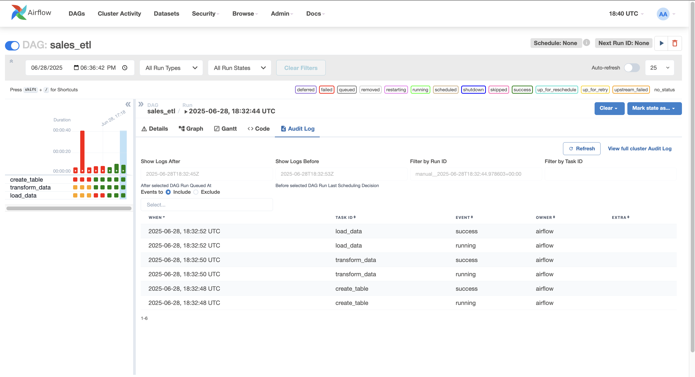
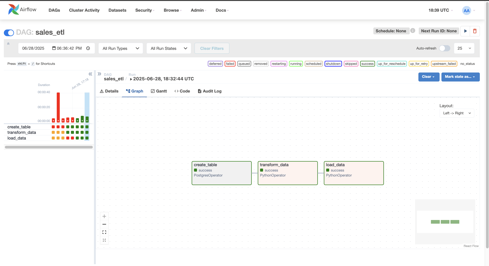

# 🧩 Airflow ETL Pipeline

---

## 🚀 Overview

- **Goal:** Read raw sales data from a CSV, calculate total sales per region, and store the summary in a PostgreSQL table.
- **Tech Stack:** Apache Airflow · PostgreSQL · Docker · Python (Pandas)

---

## 🛠 Technologies Used

- **Apache Airflow** – for scheduling and orchestrating ETL tasks  
- **PostgreSQL** – as the target database  
- **Docker & Docker Compose** – to containerize and manage services  
- **Pandas** – for data transformation in Python

---

## 📁 Project Structure

```

airflow-etl-project/
├── dags/                      # Airflow DAG definition
│   └── sales\_etl.py
├── data/                      # Raw input data
│   └── sales\_raw\.csv
├── screenshots/               # Visual proof (for README)
│   ├── airflow\_dag\_success.png
│   ├── airflow\_etl\_detail.png
│   ├── pgadmin\_table\_view\.png
│   └── task\_logs.png
├── docker-compose.yaml        # Docker setup for Airflow & Postgres
├── .gitignore
└── README.md

```

---

## 📌 How It Works

1. **Extract:** Reads `sales_raw.csv` from the `data/` folder.
2. **Transform:** Aggregates total sales per region using Pandas.
3. **Load:** Writes the aggregated data to a PostgreSQL table `sales_summary`.

---

## 🧠 Learnings

- ✅ How to define DAGs using Airflow  
- ✅ How to use `PythonOperator` and `PostgresOperator`  
- ✅ Writing idempotent ETL logic  
- ✅ Triggering and monitoring tasks via the Airflow UI  
- ✅ Interacting with PostgreSQL using PGAdmin

---

## 📸 Screenshots

### ✅ DAG Success in Airflow


### 🔍 Task Logs


### 📊 PGAdmin Table Output


### 🧱 ETL Detail in Terminal


---

## 🙌 Author

**Chetana Thorat**  
📧 thoratchetana8@gmail.com  
🔗 [LinkedIn](https://www.linkedin.com/in/chetana-thorat/) | [GitHub](https://github.com/Chetana-Thorat)
```
